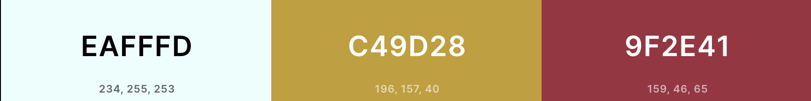

# Harry Potter Quiz - Javascript
## Welcome to the <a href ="https://nameiswaiyinsin.github.io/javascript-harrypotter-quiz/">Harry Potter Quiz</a> README.md !

This Harry Potter quiz is an interactive quiz game where players can test their knowledge about all things Harry Potter! There are 10 questions to answer in the game. If the player answers a question correctly, they will receive 10 points. After completing the game, the user can save their high score and later look back on the top high scores for the game. This game is great fun for users to play and test their knowledge on this epic saga! 

# Live Site
https://nameiswaiyinsin.github.io/javascript-harrypotter-quiz/

# Repository
https://github.com/nameiswaiyinsin/sustainlife

# Target Audience
<li>People who enjoy Harry Potter</li>
<li>People who enjoy getting their knowledge tested</li>
<li>People who enjoy quiz games</li>

# Project Objective
To offer players an enjoyable experience quizzing their Harry Potter knowledge and compete for the highest score. This game contains questions 10 questions for great fun and allows the player to save their score for comparison! It is suitable for anyone who enjoys learning about Harry Potter and being quizzed on it.

# (UX) User Experience
## Site Owner Goal
<li>Create an attractive, responsive and intuitively simple to use game for the user.</li>
<li>I want the site to function properly, loading new questions and incrementing the score as the user progresses. </li>
<li>Create a game with a varied choice of questions for a better user experience.</li>
<li>Allow users to save their scores</li>
<li>Allow users to navigate easily through different pages of the site</li> 

## User Story - First time Visitor Goal
<li>Ensure an aestheticly designed and easy to read game.</li>
<li>Ensure the game is responsive to all devices.</li>
<li>Ensure that the user is able to navigate throughout different pages of the site.</li>
<li>Ensure a varied choice of questions.</li>

## User Story - Returning Visitor Goal
<li>Ensure a varied choice of questions each time a user plays.</li>
<li>Be able to record the user's own score for leaderboard reference.</li>
<li>Be able to to see other user's previous scores for competition.</li>

# Design
## Colour Scheme
<li>I chose a minimal colour palette with 2 colours features heavily in Harry Potter to keep within the theme.</li>
<li> I used https://coolors.co/ to generate my pallete.</li>

## Typography
<li>I chose Roboto, sans-serif as the font as it a very readable font which also looks fiting for the theme of the website. </li>
<li>Sans-serif is the back-up font if Roboto fails, it is also an easy to read font.</li>
<li>The font was sourced from Google fonts.</li>

## Wireframe
### Desktop

### Mobile 

## Site structure
### Start Page

### Game Page

### End Page

### High Scores Page

# Testing

## Testing Responsive Design

## Validator Testing
### HTML

### CSS

### Javascript

### Lighthouse
### Desktop

### Mobile

# Bugs

# Deployment
I deployed the site on GitHub pages.

1. Go to project repository, navigate to the Settings tab.
2. Select Pages tab from the left hand menu.
3. In Source section, drop-down the menu and select the Main Branch and click Save.
4. After the page has refreshed, a ribbon will display indicating the successful deployment of the site and link to the live page.

## Local Deployment
Steps to clone this project from GitHub:

1. In the project repository, navigate to the code button.
2. Select download Zip from the clone menu.
3. Once zip file has been downloaded, unzip the file.
4. Save the file and run it locally.
5. The live site can be found using the following URL - https://nameiswaiyinsin.github.io/javascript-harrypotter-quiz/

# Technologies used
<li>HTML</li>
<li>CSS</li>
<li>Javascript</li>
.

# Credits
## Contents
Font was sourced from Google Fonts https://fonts.google.com/
## Tutorials
Javascript Quiz Tutorial - https://www.youtube.com/watch?v=u98ROZjBWy8&t=7s

## Quiz Questions
https://www.beano.com/posts/the-ultimate-harry-potter-quiz

# Media
<li>Background picture was taken from Google Images - <a>https://encrypted-tbn0.gstatic.com/images?q=tbn:ANd9GcTdk1tQH7Jo62z8PgAvrHyuU2Lhkc6zK5ek8g0SL9Cmq8Fj6uIcH2g5Mk1MB3TJHFO18rU&usqp=CAU</a></li>
<li>Logo downloaded from Seek Logo - <a>"https://seeklogo.com/vector-logo/65455/harry-potter"</a></li>
<li>Responsive Design Mockup Tool - <a>https://techsini.com/multi-mockup/index.php</a></li>
